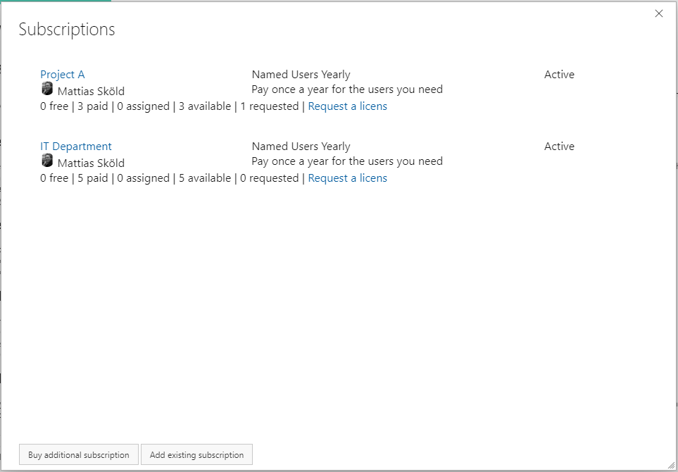

## Managing subscriptions 
Once a subscription has been purchased you can manage it by navigating to the subscription list page. 

### 1. Navigating to your subscription 
This can either be done by 

or by 

### 1. Selecting your subscription 

From the list of subscriptions - click on the subsription you want to manage/change. Only the subsc
From here you can purchase additional subscriptions or manage existing subscriptions by clicking on them. 

### 2. Assing users to your subscription
Once purchased you need to assign the users to your subscription. You can change the assigned users at any time.

You can either search for users (part of any team in any projects) or approve request from users requesting a licenses. 

**Auto approval of licenses requests**
Subscription owners can also turn on Auto approval for licensing requests on the settings tab. By doing so the need for manual intervention for assigning a user to a license is removed. 
With the auto approval turned on - unlicensed users requesting a license will directly be assigned a license and taken directly to the export tab, provided that the subscription has available users to assign. 

### 3. Change the number of purchased users. 
On the top of your subscription there is links to **change the quantity**
All changes of of the quantiy will be done directly and will result in a new invoice with pro rated charges. 
If you want to avoid having an extra invoice - please reach out to extension-support@mskold.com and we will assist you.

### 4. Change billing details. 
On the top of your subscription there is links to **change billing details**  it will open up this form
If you need to change the card information on file - the simplest way is to drop an email to extension-support@mskold.com and we will send a secure link for updating the card details.

### 5. Change owner of the subscription 
To change the owner of the subscrition you go to the settings tab of the subscription and change the owner by dropping down the listbox and chaning user.

### 6. Cancel a subsription 
On the top of your subscription there is links to **cancel the subscription**  it will open up a form for submitting your cancellation. 
Please provide the reason for cancellign and also note that the cancellaion will take effect directly. 
If you want the subscription canceled on the end of the term or on a specific date - please reach out to extension-support@mskold.com and we will assist you.

