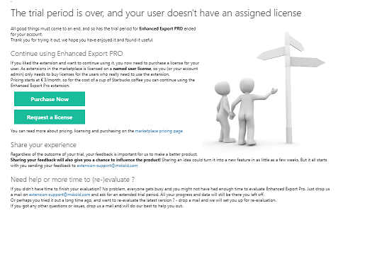
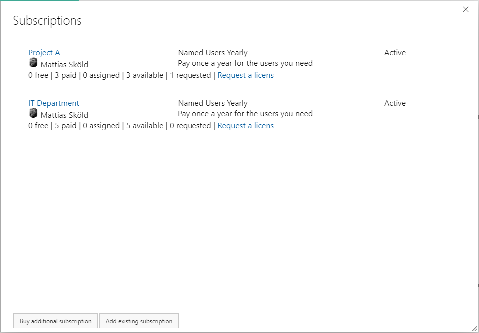
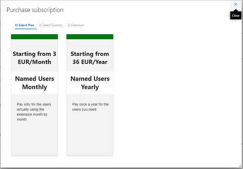
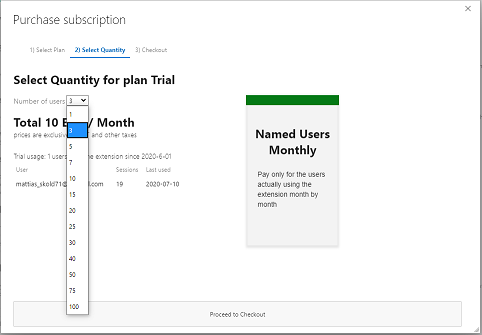
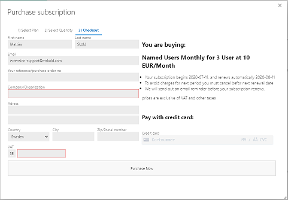
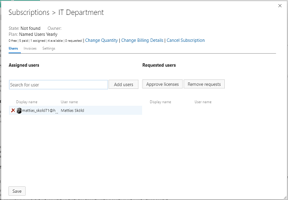

## Introduction 
Enhanced Export PRO is licensed through subscriptions. You can have multiple subscriptions side by side with separated billing and management. 
. Each user who wants to use extension needs to have an active subscription or they will see this screen. 

From here you can **purchase** a subscription or **request a license** from an existing subscription in your organization. 

## Managing subscriptions 
Once a subscription has been purchased you can manage it by clicking on the Shopping cart icon or navigating to the organization level settings for Enhanced Export PRO.

From here you can purchase additional subscriptions or manage existing subscriptions by clicking on them. 

## Purchasing a new subscription

You can purchase a new subscription with a credit card directly through Enhanced Export PRO's self-service online purchase. On digital receipt/invoice will be sent by email. 

The purchase process is a simple 4 step process
### 1. Select a plan

### 2. Select a quantity

### 3. Provide customer & credit card information

### 4. manage your purchased subscription
Once purchased you need to assign the users to your subscription. You can change the assigned users at any time.

## Managing subscription
On the top of your subscription there is links to **change the quantity**, **change billing details** and **cancel the subscription**. You can access your invoices on the **Invoice tab** and on the **Settings tab** you can rename your subscription and change owner of it. 

The main activity managing a subscription is to manage the users assigned to that subscription. That is done from the users tab either by searching for users by their name or email. You can also view the users who has requested a license and manual approve their requests. 

**Auto approval of licenses requests**

Subscription owners can also turn on Auto approval for licensing requests on the settings tab. By doing so the need for manual intervention for assigning a user to a license is removed. 
With the auto approval turned on - unlicensed users requesting a license will directly be assigned a license and taken directly to the export tab, provided that the subscription has available users to assign. 

