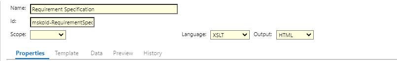
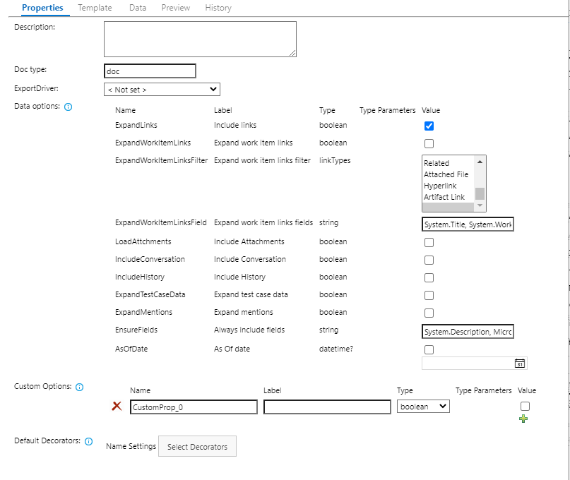
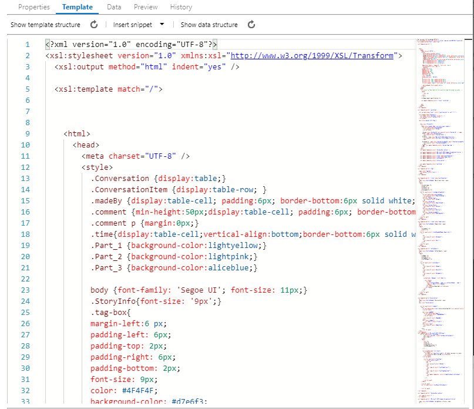
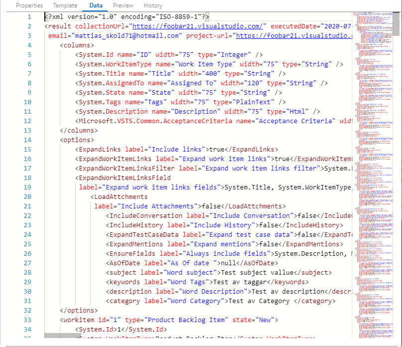
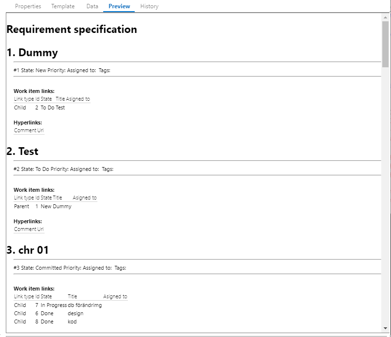
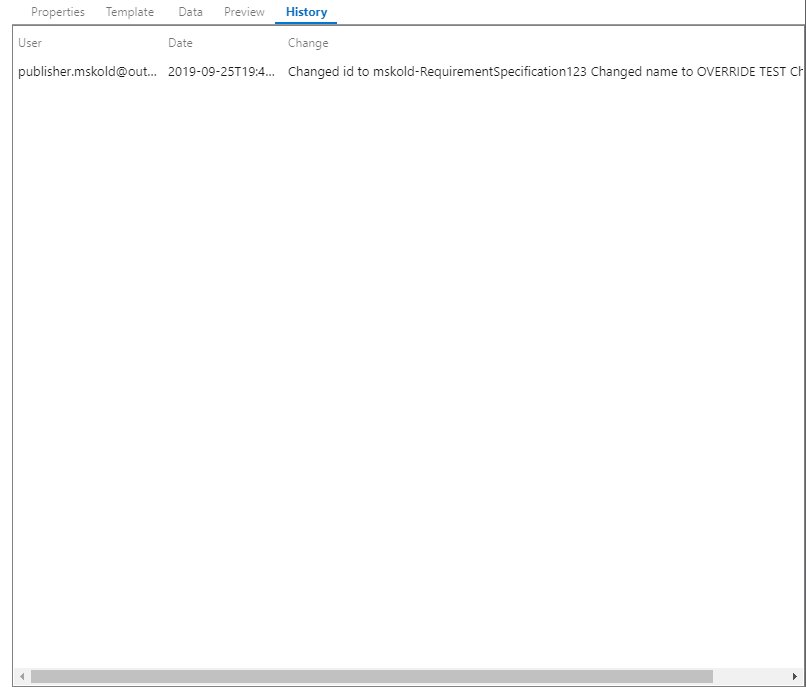

## Introduction
In Enhanced Export PRO all settings are stored in Templates that is accesseible for all users.
The extension comes with a set of predifned templates out of the box intended to showcase the capablilities and server as a starting point for customers. 
You can copy existing templates and modifying them or create new templates with the Admin hub.
The out of the box templates has the **Default** scope and can not be overwritten, users can save Templates with the scoped of **Collection** visible to all projects, or **Project** only vissible for the current project. 

You can navigate to the Admin hub by either clicking the settings gear on the export tab, or by selecting Project settings and then clicking Enhnaced Export PRO in the left-hand lower corner.

## Languages 
Enhanced Export PRO uses common well-known languages for renderign the data into a document. There is plenty of resources avaible on internet for learning and mastering them, below is just some examples. 
* [HTML](https://www.w3schools.com/html)
* [XML](https://www.w3schools.com/xml)
* [XSLT](https://www.w3schools.com/xml/xsl_intro.asp)

## The Template editor 
The left part of the template editor is the navigation part there you can see and select all templates. 
It also contains functions for exporting and importing templates, mainly used for moving templates between organizations and for support

The right part is the edit area for the template. It contains of a common header area and tabs for different parts of the templates. Down at the bottom you have buttons for **Copying**, **Saving** and **Deleting** the template.  You can also use Ctrl +S for saving.

## Common Header 
 

Here you set the Name, Id and scope for your template. By setting the same ID as an out of the box template - you can "override" it with your template. 
You can also choose the language that should be used for your template and what the output format of the template is. 

## Properties tab
 
The properties tab contains the default values for all settings. 

|   |   |
|---|---|
| Description | A general description for the template   |
| DocType | The default file extension used then user opens /downloads the rendered report |
| Export driver | The default export driver used then user opens /downloads rendered report |
| Data options | This sets the defualt options used for fetching data.  |
| Custom options | You can create your own custom options that you can use for controling the rendering. |
| Default decorators| Defualt decorators to be applied once the rendering is complete.  |

## Template tab
This is the editor for the transformation template. 
 

|   |   |
|---|---|
| Show template structure | Shows a treview of the template structure for easy of understanding and quick navigation. |
| Insert snippet | Inserts XSLT tags for word codes and work item fields   |
| Show data structure| Shows a tree view of the data structure. |

## Data tab
Shows the fetched data for the *latest successful export**
 

## Preview
Preview / test the template and shows the results 
 
Clicking the preview will apply the content of the template tab with the content of the Data tab and show the result. This enables you to test your template. 

## History 
Shows the revision history for the template 
 

