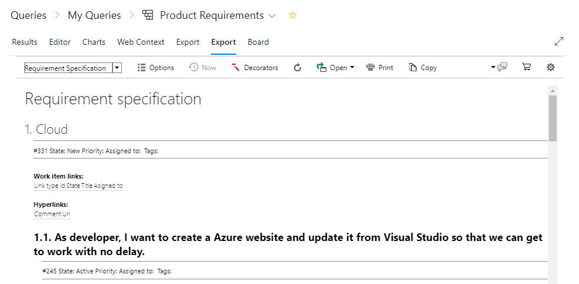
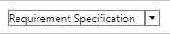
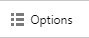
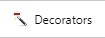
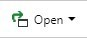
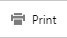
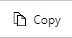

## Introduction
Enhanced Export PRO is designed to be easy to use and yet powerful and flexible to
create custom solutions to be able to meet all your requirements. To solve this, we
have put focus on making the everyday operations needed by most users easy to use
and easily accessible as an **Export Tab** on work item queries and test plans.

Having the output look and feel like your organization’s documentation is also
something we have focused on making easy do. You can simply **take your own word
document** and make Enhanced export PRO use it as word template for its word
export. Images and other resources are of course embedded in the exported
document so you can share it with others.

To enable the power and flexibility, customized solutions can be created and
packaged as a onetime effort and then used by everyone. All advanced feature
needed for creating customized solutions is put into the Admin Hub.

## Export tab for day to day operations
For your day to day operations you have the export tab right in your workflow, just
click on the export tab and it will render a report with your current Work Item Query
or Test plan. You can easily change between a number of prebuilt templates and your own custom templates producing different reports. 

# Functionality in the export tab
|     |     |
|-----|-----|
|Template selector  | The template selector lets you select what template you want to render the report. The template defines the structure and layout of how the data is presented. By choosing different templates your data can be presented  like a grid, a specification or a traceability matrix. You can easily copy or create your own custom templates in the Admin hub. |
| Options |  Options lets you mainly control what extra data you want to collect. Collecting more data gives you more detailed reports but takes more time. The available options are different between work item queries and test plans. |
| Decorators | Decorators lets you apply different styling rules to the report. Clicking this will show the available Decorators and lets you choose which ones you want to apply and set properties if the decorator has any.|
|Refresh | Refresh the data and rendering|
|Open |Exports the report area to the destination you choose in the dropdown. Enhanced Export PRO supports exporting to multiple word templates, as well as simpler formats like HTML and Mime HTML.
|Print |Prints the report using the standard browser printing|
|Copy | Copies the entire report to the clipboard, so you easily can paste it into other applications. |
|Support  | Displays a sub menu with different support options for contacting support, as well as the currently loaded extension version |
|Purchase  |Let’s you purchase and manage your purchased licenses.|
|Settings | Opens the Admin hub used for editing templated, decorators and document templates|

## Create your own word template
You can simply take your ordinary word document with your organizations logo and
styling and convert it to a word template used by Enhanced Export PRO to create its
word document.
Just follow this procedure to create your own template.
1. Open an ordinary word document that is according to your organization’s
standards and styling
2. At the location you want the export data to start, enter the text
%%HTML_CONTENT%%
3. Save the document (as an ordinary word document)
4. Go to the admin hub for Enhanced Export PRO
5. Select the Library tab
6. Click Add new Library item
7. Give your template a name, id and select a scope
8. Click the Change item button
9. Upload the document
10. Click Save
 

## Edit templates 
The Admin hub is the place for editing templates . While creating customization
can be a bit technical, it’s fairly easy to copy an existing template and make minor
changes like adding or removing fields without technical knowledge.

# Simple Modifications

To make minor changes to an existing template – follow those steps:
1. Go to the admin hub
2. Select the template you want to make changes to in the left-hand
menu.
3. Change the name and id and set a scope for your template.
4. Set the scope of the template (Project or Collection)
5. Click on the template tab
6. Find the location/field you want to change/remove
7. Remove or copy an existing field and change the field name.
8. For field names and data – look at the Data tab
9. Save

# Advanced customizations
If you want to do advanced custom solutions, the technologies used for templates is
mainly XML, XSLT and HTML. If you prefer the Enhanced Export PRO version also
supports Handlebars and markdown. 

